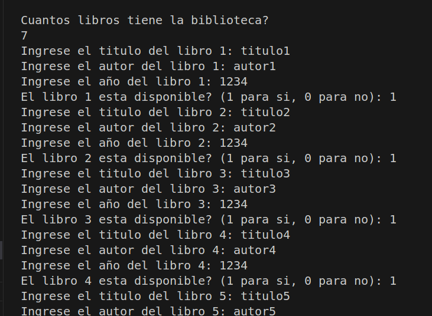
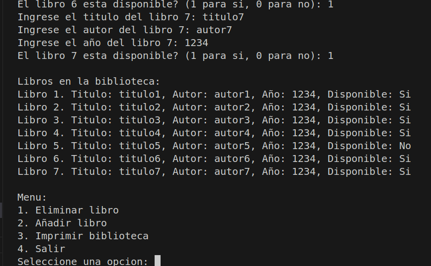
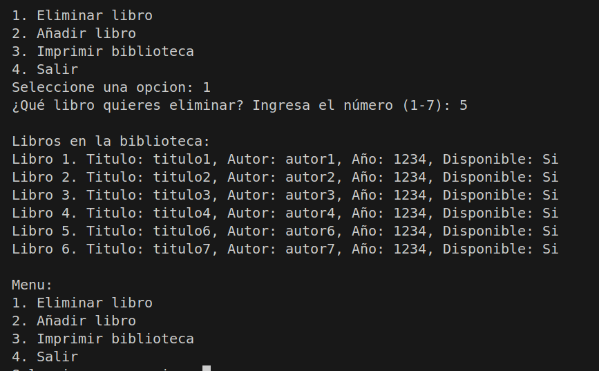
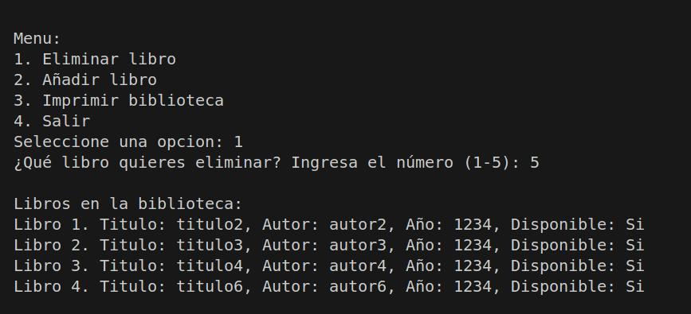
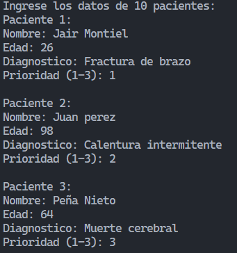
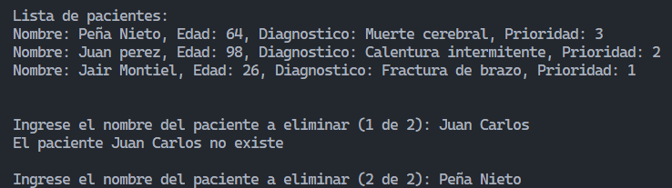
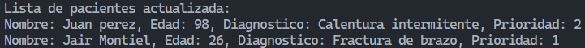

# Ejercicio-de-estructuras-en-C
Tarea 3 del curso programación en C, del Prebecariado en PROTECSA 

## Ejercicio 6 Biblioteca
Task: Crea un sistema que gestiones un catálogo de libros en una biblioteca, donde los libros puedan añadirse o eliminarse dinámicamente durante la ejecución 

En nuestra solución a este ejercicio creamos una serie de funciones para manejar la biblioteca  

- **imprimirBiblioteca**
- **pedirDatosLibro**
- **eliminarLibro**
- **añadirLibro**

  ### Ejercicio de ejecución: Se añaden 7 libros iniciales, se elimina 3 libros específicos y se imprime el catalogo actualizado.
Para usar este código solo necesitas correrlo, te preguntara por tu stock inicial de libros, después podrás ingresar sus datos (Título, autor, año de publicación y si lo tienes disponible o no).

 

Una vez que hayas completado los datos aparecerá un menú para añadir libros, eliminar e imprimir la biblioteca actual. DIgitas la opción que prefieras y puedes actualizarla en cualquier momento.

 

Elimina facilmente los libros escribiendo el índice, lo puedes consultar siempre en las impresiones.

 

Al eliminar cada libro el indice de cada libro se habrá movido de lugar, asegurate de elegir bien tu siguiente eliminación. 

## Ejercicio 7 Hospital
Task: Crea un programa que simule la gestión de pacientes de un hospital, donde cada paciente tiene su nombre, edad, diagnóstico y priodidad (1-3, donde 1 es urgente).

Se tienen las siguientes solucioens en el programa
- **nuevoPaciente**: Añade un nuevo paciente al inicio de la lista. 
- **eliminarPaciente**: Elimina un paciente en base a un nombre específico (que esté en la lista).
- **imprimirLista**: Imprime la lista de pacientes.
- **main**: Flujo principal del programa.

  ### Ejercicio de ejecución: Se añaden 10 pacientes iniciales, se eliminan 2 pacientes específicos y se imprime la lista actualizada.
Al ejecutar el código, lo primero que se solicita es la información de cada uno de los 10 pacientes, y se debe de rellenar tal que:
- **Nombre**: Ingresa el nombre completo.
- **Edad**: Ingresa un valor entero de la edad del paciente.
- **Diagnóstico**: Describe el diagnóstico o enfermedad del paciente.
- **Prioridad**: Indica la prioridad (del 1 al 3) del paciente.

 

Una vez completados los datos de todos los pacientes, imprime la lista y el programa solicita el nombre de 2 pacientes a eliminar. Debes de escribir el nombre tal cual aparece en la lista, o de lo contrario te dirá que no existe el usuario.
Nota: En la captura sólo se meustran 3 pacientes para hacer más simple el ejemplo, pero el programa solicitará y mostrará a 10 pacientes en total.

 

Al eliminar a un paciente, la lista enlazada se actualiza, e imprime en pantalla la nueva lista.

 